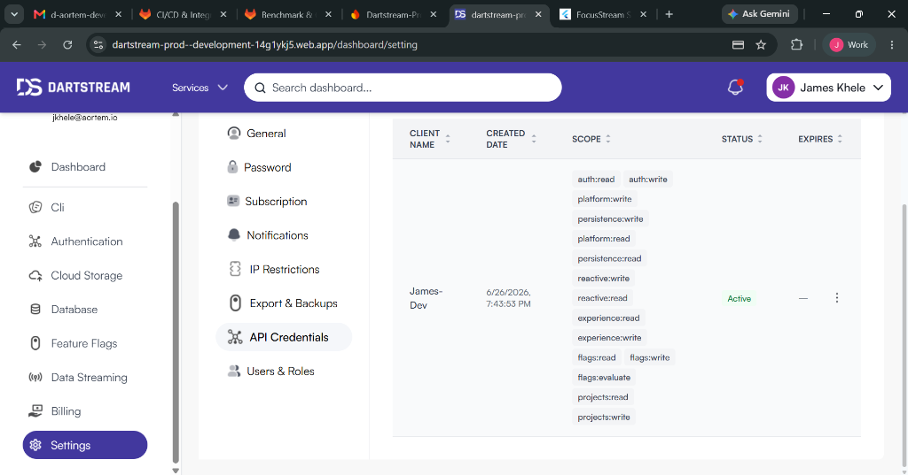

# FocusStream — Premium SaaS Productivity Dashboard

FocusStream is a premium business-themed SaaS task and productivity dashboard. It serves as a customer-facing showcase for the **DartStream SaaS** product suite, demonstrating how to integrate authentication, feature flags, profile details, inventory (unlocked workspace assets), cloud-save snapshots, reactive event logging, and database explorer flows.

It is designed as a standalone sample application implementing a business/SaaS workflow (as an alternative to the gaming/RPG reference apps).

---

## Project Artifacts

1. **`bin/smoke.dart`** — A headless Dart CLI that executes the full Dev API contract suite (10/10 endpoints) and prints `PASS/FAIL`. Run this first to confirm connectivity.
2. **`pubspec.yaml`** — Adds the official `dartstream_client` dependency instead of custom REST API layers.
3. **`lib/state/session.dart`** — Session coordinator managing token lifecycles and `DartStreamClient` session state.
4. **`lib/models/workspace_data.dart`** — Structured workspace models representing Kanban board task layouts, Pomodoro timers, and theme details.
5. **`lib/services/cloud_save_service.dart`** — Debounced cloud save snapshot controller under slot key `focusstream`.
6. **`lib/screens/`** — Premium dark-themed user interfaces for authentication and the core SaaS productivity dashboard.

---

## Prerequisites

* **Supported toolchain floor**: Flutter 3.44.1 / Dart 3.12.1 (verified building — `flutter build web` + `dart analyze` both green on this exact pair). Note that while the project's own package constraint specifies `>=3.12.0`, the official `dartstream_client: 0.0.1` package requires Dart `^3.12.1` (bundled with Flutter `3.44.1`), making `3.12.1` the effective toolchain floor.
* **Chrome browser** (client runs on `-d chrome` / web-server)

---

## Configuration

The app reads environment variables from your environment or `.env` files. By default, it is configured to talk to the live `dartstream-prod` Firebase project and `dev-api*.dartstream.io` subdomains.

| Variable | Default Value | Purpose |
| --- | --- | --- |
| `FIREBASE_API_KEY` | `injected at runtime (see below)` | Web API key for authentication |
| `TEST_EMAIL` | `you@example.com` | Default testing user |
| `TEST_PASSWORD` | `change-me` | Default testing password |

---

## Running the Smoke CLI

To verify dev-api endpoint connectivity, open a terminal in this directory and run:

```bash
dart run bin/smoke.dart
```

This will run all E2E SDK checks and print a summary:
```
== FocusStream E2E smoke ==
  auth        : https://dev-apiauth.dartstream.io
  platform    : https://dev-apiplatform.dartstream.io
  experience  : https://dev-apiexperience.dartstream.io
  reactive    : https://dev-apireactive.dartstream.io
  persistence : https://dev-apipersistence.dartstream.io
  user        : smoketest@dartstream.test

-- Firebase sign-in --
   [PASS] Firebase signInWithPassword -> got idToken
-- POST /api/v1/auth/signup --
   [PASS] POST /api/v1/auth/signup -> 200 in 949ms
   extracted userId=2d22da99-4b25-4f18-9126-e5c77febec79 tenantId=6df64ec5-a082-4c26-9648-ab9f419f730b
-- GET  /api/v1/auth/me --
   [PASS] GET  /api/v1/auth/me -> 200 in 937ms
-- GET  /api/v1/platform/feature-flags --
   [PASS] GET  /api/v1/platform/feature-flags -> 200 in 3123ms
-- GET  /api/v1/experience/profiles/me --
   [PASS] GET  /api/v1/experience/profiles/me -> 200 in 648ms
-- POST /api/v1/experience/cloud-save/snapshot --
   [PASS] POST /api/v1/experience/cloud-save/snapshot -> 201 in 581ms
-- GET  /api/v1/experience/cloud-save/snapshot --
   [PASS] GET  /api/v1/experience/cloud-save/snapshot -> 200 in 558ms
-- GET  /api/v1/experience/inventory/items --
   [PASS] GET  /api/v1/experience/inventory/items -> 200 in 583ms
-- POST /api/v1/reactive/events/log --
   [PASS] POST /api/v1/reactive/events/log -> 201 in 1520ms
-- GET  /api/v1/reactive/streaming/channels --
   [PASS] GET  /api/v1/reactive/streaming/channels -> 200 in 2216ms
-- GET  /api/v1/persistence/database --
   [PASS] GET  /api/v1/persistence/database -> 200 in 769ms

== Summary: 10 pass, 0 fail ==
```

---

## Running the Flutter Web Client

The Firebase web API key is required at build time since the application relies on it for client-side authentication. In addition, the Firebase web API key is HTTP-referrer-restricted in Google Cloud, and `http://localhost:3000` is on the allowlist. Therefore, the dev server must run on **port 3000** with the key injected via `--dart-define`:

```bash
flutter pub get
flutter run -d chrome --web-port=3000 --dart-define=FIREBASE_API_KEY=YOUR_FIREBASE_API_KEY
```

---

## Features Handled by DartStream

* **Authentication**: Login/signup screen integrated with Firebase Identity Toolkit REST APIs.
* **Workspace Kanban Board**: Dynamically auto-saves the entire board layout (tasks, project filters) as a cloud save snapshot under slot key `focusstream`.
* **Pomodoro Timer**: Completing a timer session updates lifetime statistics, logs a `focus.session.completed` reactive event, and autosaves the state.
* **Live Explorer**: Side rail display showing live feature flags, profiles details, user sessions, database entries, and channels.

---

## How Auth Works (and why)

FocusStream implements a secure, browser-safe authentication flow using the official `dartstream_client` SDK:
1. The client authenticates against **Firebase Identity Toolkit** with the project's public **Web API Key** and obtains a Firebase **ID token** using `client.auth.signInWithEmailPassword` (or sign up).
2. It exchanges that token with the DartStream SaaS backend using `client.auth.onboardFirebaseSession` to securely bootstrap the user/tenant session.

This approach is browser-safe because it avoids shipping privileged service-account credentials in the client code.

---

## Verified End-to-End (live `dartstream-prod`, 2026-06-10)

* **Smoke CLI**: 10 / 10 PASS across all five services (Auth, Platform, Experience, Reactive, Persistence).
* **Workspace Synchronization**: Verified that adding, moving, and completing tasks correctly updates the cloud save snapshot state and fires reactive event logs to the server.

---

## Application UI & Interaction Preview

* **Dashboard Overview**: A premium dark-themed UI displaying workspace tasks, Pomodoro timers, and live SaaS integrations.
  

## Firebase Hosting Deployment

The app is configured for **Firebase Hosting**. The hosting target is `focusstream-sample-app`. Deployment is managed through the GitLab CI/CD pipeline. Due to a known issue with the latest `firebase-tools` (v15.22.x) breaking Workload Identity Federation, the pipeline pins `firebase-tools` to version `13.12.0`. Until the upstream bug is resolved, deployments should be triggered via the CI pipeline or locally using:

```bash
firebase use --add # select the project
firebase deploy --only hosting
```

Make sure your local `.env` contains the `FIREBASE_API_KEY` and that the CI environment variables are set.
